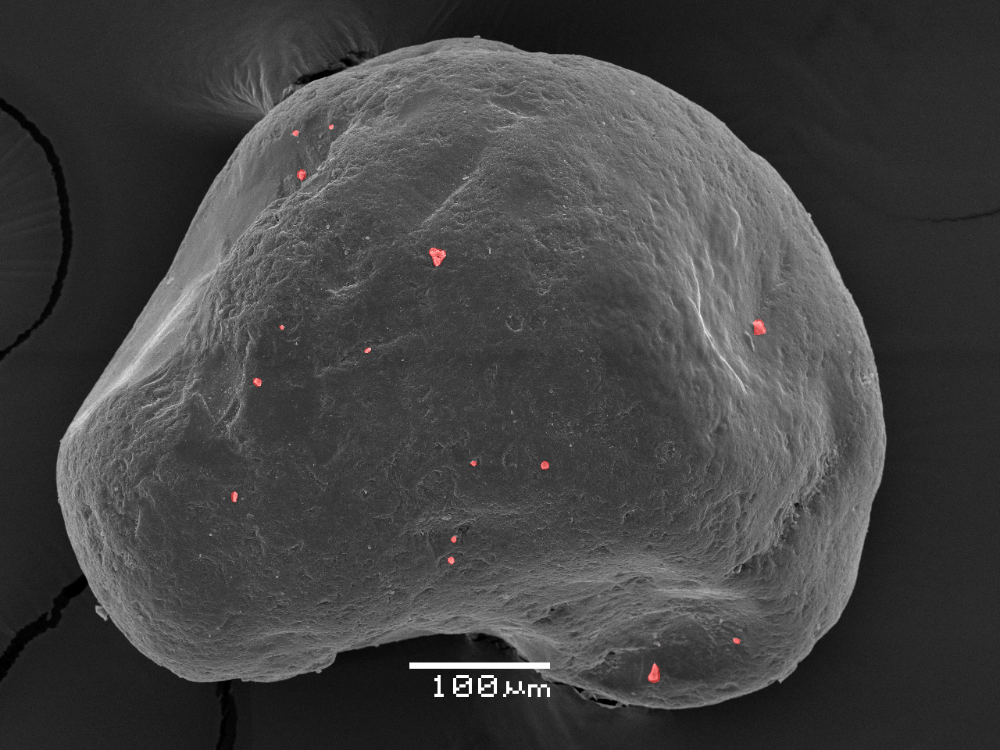

# Classification of sand grains based on image data from electron microscopes

Tool on segmentation 5 sand grain microtextures (two chemical and three mechanical).
The repository contains data, train/inference code and showcase of a final model. This repository
was created as a part of batchelor thesis on the Faculty of Informational Technologies in 
Czech Technical University in Prague.



As a final segmentation model was selected DeepLabv3+. Model can segment 
microtextures with next IoU on test set:

 | Microtexture      | IoU   |
|-------------------|-------|
| pitting           | 0.111 |
| edge_abrasion     | 0.197 |
| precipitation     | 0.229 |
| adhering_particles | 0.415 |
| conchoidal_fracture | 0.452 |

## How to run

The simplest way to run this tool is 
[Google Colab Notebook](https://colab.research.google.com/github/DainfromLiria/Sand_grains_classification/blob/main/showcase_colab.ipynb).

If you want to run this project locally, make the next steps:

1. Clone this repository
```bash
git clone https://github.com/DainfromLiria/Sand_grains_classification.git
```

2. In the project folder run `setup.sh` script (firstly run `chmod +x setup.sh` if a script doesn't have execute permission). Next
script makes python venv, install all requirements and merge model chunks into
one `model.pt` file. Splitting on chunks allows loading a large model file
on GitHub.
```bash
source setup.sh
```

3. Run jupyter notebook
```bash
jupyter notebook showcase.ipynb 
```

### Train and validation

If you want to run model in train or validation mode, add `.env`
file into the project directory. `.env` must contain 
[Neptune](https://neptune.ai) project name and API key in format:
```
NEPTUNE_PROJECT=<project_name>
NEPTUNE_API_KEY=<api_key>
```
You can find this information inside your Neptune profile 
after you create a project.

Use `run_train.sh` for running the train loop.

## Project Structure

* 📁 [data](data) - evaluation and train dataset with annotations in COCO format
* 📁 [examples](examples) - images for `README.md`
* 📁 [input_images](input_images) - user images for prediction. Folder already contains six example images
* 📁 [results](results) - model weights and file with train settings
* 📁 [scripts](scripts) - utility scripts for visualization data from Neptun and dataset statistics. 
Script on split/merge 'model.pt'
* 📁 [src](src) - main project folder with source code
* 📄 [run_train.sh](run_train.sh) - bash script for running model train loop using `nohup`
* 📄 [setup.sh](setup.sh) - bash script for setup venv, install requirements and merge model chunks into `model.pt`
* 📄 [showcase.ipynb](showcase.ipynb) - showcase of final model for local run on PC.
* 📄 [showcase_colab.ipynb](showcase_colab.ipynb) - showcase of final model for Colab.